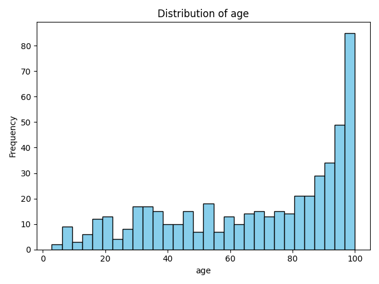
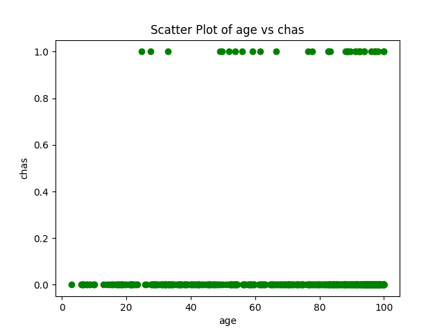

# IDS706_alejandroparedeslatorre_individualproject1
Individual project IDS-706 Alejandro Paredes La Torre 

This repo contains a brief implementation of basic descriptive metrics for the Boston Housing dataset. If you want to use this just refer this to a codespace in github and wait for the devcontainer to execute the Makefile that execute the following: install, format, lint, test.

According to the requirement we have

* `Makefile`

* `Dockerfile`

* `requirements.txt` with a set of specifications

* `githubactions` 

* `.devcontainer` for Githubcodespace 

## A quick video demo for this project in youtube:

## Purpose of project
The purpose of this project is to have a dataframe as input and compute the mean, median, std and plot some charts. To test this function the file test_main.py is used

The Boston Housing Dataset is a derived from information collected by the U.S. Census Service concerning housing in the area of Boston MA. The following describes the dataset columns:

- CRIM - per capita crime rate by town
- ZN - proportion of residential land zoned for lots over 25,000 sq.ft.
- INDUS - proportion of non-retail business acres per town.
- CHAS - Charles River dummy variable (1 if tract bounds river; 0 otherwise)
- NOX - nitric oxides concentration (parts per 10 million)
- RM - average number of rooms per dwelling
- AGE - proportion of owner-occupied units built prior to 1940
- DIS - weighted distances to five Boston employment centres
- RAD - index of accessibility to radial highways
- TAX - full-value property-tax rate per $10,000
- PTRATIO - pupil-teacher ratio by town
- B - 1000(Bk - 0.63)^2 where Bk is the proportion of blacks by town
- LSTAT - % lower status of the population
- MEDV - Median value of owner-occupied homes in $1000's

## Preparation
1. open codespaces 
2. load repo to code spaces
2. Wait for the installation of all the requirements in requirements.txt

## Output
1. We have as a result a pdf with the [Houses Report](Houses_Report.pdf)
 
2. The plots for the selected variables:

